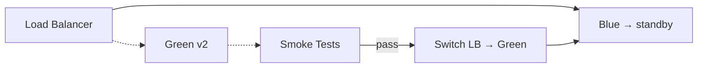

# Deployment Strategies

## Rolling Update

Gradually replaces pods/instances with the new version. Default strategy in Kubernetes.

### Kubernetes Parameters

| Parameter | Default | Description |
|-----------|---------|-------------|
| `maxSurge` | 25% | Max number (or %) of extra instances above desired during update |
| `maxUnavailable` | 25% | Max number (or %) of instances that can be unavailable during update |
| `minReadySeconds` | 0 | How long a new pod must be ready before considered available |
| `revisionHistoryLimit` | 10 | Number of old ReplicaSets retained for rollback |

```yaml
apiVersion: apps/v1
kind: Deployment
metadata:
  name: app
spec:
  replicas: 5
  strategy:
    type: RollingUpdate
    rollingUpdate:
      maxSurge: 1
      maxUnavailable: 0
  minReadySeconds: 10
  revisionHistoryLimit: 3
```

### Tradeoffs

| Pro | Con |
|-----|-----|
| Zero additional infrastructure | Slow rollout with many replicas |
| Automatic; no manual switch | No traffic isolation — both versions mix |
| Built into Kubernetes | Rollback requires `kubectl rollout undo` |
| No DNS/LB changes needed | Canary not supported natively |

### Commands

```bash
kubectl set image deployment/app app=registry/app:sha
kubectl rollout status deployment/app
kubectl rollout undo deployment/app
```

---

## Blue-Green

Two identical environments (blue = current, green = new). Switch traffic atomically.



### Load Balancer Switching

| Method | Latency | Risk | Complexity |
|--------|---------|------|------------|
| **DNS weighting (weighted records)** | Minutes (TTL-dependent) | Low — gradual shift | Low |
| **ALB/ING target group swap** | Seconds | Low — instant shift | Medium |
| **Service mesh traffic split** | Sub-second | Low — precise control | High |
| **kubectl patch service** | Seconds | Low — selector change | Low |

### Kubernetes Service Swap

```bash
# Deploy green
kubectl apply -f deployment-green.yaml

# Wait for readiness
kubectl rollout status deployment/app-green

# Smoke tests
kubectl exec -it deployment/app-green -- curl http://localhost:8080/healthz

# Switch
kubectl patch service app -p '{"spec":{"selector":{"version":"green"}}}'

# Rollback (if needed)
kubectl patch service app -p '{"spec":{"selector":{"version":"blue"}}}'
```

### DNS Weighting

```
blue.example.com. 60 IN A 10.0.1.1
green.example.com. 60 IN A 10.0.2.1
app.example.com. 60 IN A 10.0.1.1 (weight 100)
app.example.com. 60 IN A 10.0.2.1 (weight 0)

# Shift:
# weight 50/50 → monitor → weight 100 green / 0 blue
```

### Smoke Tests

Run against green environment before switching:

```bash
for endpoint in /healthz /metrics /api/v1/status; do
  status=$(curl -s -o /dev/null -w "%{http_code}" "http://green-app/$endpoint")
  if [[ "$status" != "200" ]]; then
    echo "FAIL: $endpoint returned $status"
    exit 1
  fi
done

# Validate data integrity, check error rates, verify DB migrations
```

### Tradeoffs

| Pro | Con |
|-----|-----|
| Instant rollback (flip LB back) | 2x infrastructure cost |
| Full isolation between versions | DB schema must be backward-compatible |
| Smoke tests before traffic switch | DNS TTL delays for DNS-based switching |
| Clear version separation | Cold cache on new environment |

---

## Canary

Gradually shift a percentage of traffic to the new version. Monitor metrics to promote or rollback.

### Traffic Shifting

| Method | Granularity | Tooling |
|--------|-------------|---------|
| **Kubernetes replica count** | Coarse (1/n) | Manual `kubectl scale` |
| **Service mesh traffic split** | 1%-100% | Istio, Linkerd |
| **Ingress controller** | Weighted backends | NGINX, Traefik, Contour |
| **Serverless (Lamberd aliases)** | 1%-100% | AWS CodeDeploy |

### Kubernetes Manual Canary (replica-based)

```yaml
apiVersion: apps/v1
kind: Deployment
metadata:
  name: app-stable
spec:
  replicas: 9
  selector:
    matchLabels:
      app: app
      track: stable
---
apiVersion: apps/v1
kind: Deployment
metadata:
  name: app-canary
spec:
  replicas: 1
  selector:
    matchLabels:
      app: app
      track: canary
```

### Service mesh canary (Istio)

```yaml
apiVersion: networking.istio.io/v1beta1
kind: VirtualService
metadata:
  name: app
spec:
  hosts:
    - app
  http:
    - route:
        - destination:
            host: app
            subset: stable
          weight: 90
        - destination:
            host: app
            subset: canary
          weight: 10
---
apiVersion: networking.istio.io/v1beta1
kind: DestinationRule
metadata:
  name: app
spec:
  host: app
  subsets:
    - name: stable
      labels:
        track: stable
    - name: canary
      labels:
        track: canary
```

### Progressive Delivery with Flagger

Flagger automates canary promotion/rollback based on metrics.

```yaml
apiVersion: flagger.app/v1beta1
kind: Canary
metadata:
  name: app
spec:
  targetRef:
    apiVersion: apps/v1
    kind: Deployment
    name: app
  service:
    port: 80
    portDiscovery: true
  analysis:
    interval: 1m
    stepWeight: 10
    maxWeight: 100
    threshold: 5
    metrics:
      - name: request-success-rate
        thresholdRange:
          min: 99
      - name: request-duration
        thresholdRange:
          max: 500
    webhooks:
      - name: smoke-tests
        url: http://app-smoke-tester.default/
        timeout: 30s
        metadata:
          type: pre-rollout
```

### Progressive Delivery with Argo Rollouts

```yaml
apiVersion: argoproj.io/v1alpha1
kind: Rollout
metadata:
  name: app
spec:
  replicas: 10
  strategy:
    canary:
      steps:
        - setWeight: 10
        - pause: {duration: 30s}
        - setWeight: 30
        - pause: {duration: 1m}
        - setWeight: 60
        - pause: {duration: 1m}
        - setWeight: 100
      analysis:
        templates:
          - templateName: success-rate
        args:
          - name: service-name
            value: app
---
apiVersion: argoproj.io/v1alpha1
kind: AnalysisTemplate
metadata:
  name: success-rate
spec:
  args:
    - name: service-name
  metrics:
    - name: success-rate
      interval: 30s
      count: 10
      successCondition: result > 0.99
      failureLimit: 3
      provider:
        prometheus:
          query: |
            sum(rate(istio_requests_total{
              reporter="destination",
              destination_service=~"{{args.service-name}}.*",
              response_code!~"5.*"
            }[1m])) /
            sum(rate(istio_requests_total{
              reporter="destination",
              destination_service=~"{{args.service-name}}.*"
            }[1m]))
```

### Metrics-Based Promotion / Rollback

| Metric | Threshold | Action |
|--------|-----------|--------|
| Error rate (5xx) | > 1% | Rollback |
| p99 latency | > 500ms | Rollback |
| Request success rate | < 99% | Rollback |
| CPU/Memory | > 80% | Pause canary |
| Custom business metric | Configurable | Pause or rollback |

### Canary Checklist

- [ ] Metrics pipeline established (Prometheus, Datadog, CloudWatch)
- [ ] Baseline threshold defined per service
- [ ] Automated rollback on threshold breach
- [ ] DB migrations backward-compatible (additive only during canary)
- [ ] Observability dashboards for canary vs stable comparison
- [ ] Notification on promotion/rollback
- [ ] Canary duration limit (auto-promote or auto-rollback after N minutes)

---

## Strategy Comparison

| Criteria | Rolling Update | Blue-Green | Canary |
|----------|---------------|------------|--------|
| Rollback speed | Slow (sequential) | Instant (LB switch) | Gradual (traffic shift) |
| Infrastructure cost | Normal | 2x | Normal + mesh |
| Traffic isolation | None | Full | Partial |
| Test in production | No | Yes (smoke on green) | Yes (percentage) |
| Setup complexity | Low | Medium | High |
| Kubernetes native | Yes | No (service swap) | No (requires mesh/rollouts) |
| Best for | Simple services, low risk | Critical services, compliance | High-traffic, data-sensitive |
