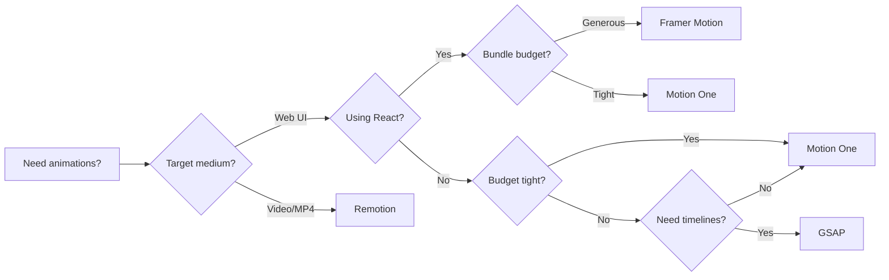

# Animation Frameworks Comparison

## Decision Matrix

| Need                          | Framework      | When to Reach For It                                   |
| ----------------------------- | -------------- | ------------------------------------------------------ |
| React component animations    | Framer Motion  | Layout animations, mount/unmount, shared layouts       |
| Complex timeline sequences    | GSAP           | Scroll-triggered, multi-step, production video/ads     |
| Lightweight / no framework    | Motion One     | Small bundles, WAAPI, vanilla JS or any framework      |
| Video / programmatic MP4      | Remotion       | Data-driven video, programmatic export, React-based    |

---

## Framer Motion

**Best for**: React apps needing declarative, layout-aware animations with minimal code.

```tsx
import { motion, AnimatePresence } from 'framer-motion'

// Mount/unmount with layout animation
<AnimatePresence>
  {isOpen && (
    <motion.div
      initial={{ opacity: 0, height: 0 }}
      animate={{ opacity: 1, height: 'auto' }}
      exit={{ opacity: 0, height: 0 }}
      transition={{ type: 'spring', stiffness: 300, damping: 30 }}
    />
  )}
</AnimatePresence>

// Shared layout animation (automatically animates between positions)
<motion.div layout layoutId="card" />
```

**Strengths**:
- Declarative API — no imperative refs or timelines
- `AnimatePresence` handles exit animations when components unmount
- `layout` prop auto-animates position/size changes (FLIP)
- `layoutId` for shared element transitions (hero patterns)
- Gesture helpers: `whileHover`, `whileTap`, `whileDrag`, `whileInView`
- Scroll-linked via `useScroll` and `useTransform`
- Variants for orchestrating parent/child animations

**Limitations**:
- React-only (not usable in vanilla JS or other frameworks)
- Bundle size: ~35 kB gzipped (not tiny)
- Performance can degrade with many simultaneous layout animations

**Install**: `npm install framer-motion`

---

## GSAP (GreenSock Animation Platform)

**Best for**: Production-grade timeline sequences, scroll-triggered animations, cross-browser reliability.

```ts
import { gsap } from 'gsap'
import { ScrollTrigger } from 'gsap/ScrollTrigger'

gsap.registerPlugin(ScrollTrigger)

// Timeline with precise sequencing
const tl = gsap.timeline({ defaults: { duration: 0.6, ease: 'power2.out' } })
tl.from('.hero-title', { y: 80, opacity: 0 })
  .from('.hero-subtitle', { y: 40, opacity: 0 }, '-=0.3')
  .from('.hero-cta', { y: 20, opacity: 0 }, '-=0.2')

// Scroll-triggered parallax
gsap.to('.parallax-bg', {
  y: '30%',
  ease: 'none',
  scrollTrigger: {
    trigger: '.section',
    start: 'top bottom',
    end: 'bottom top',
    scrub: true,
  },
})
```

**Strengths**:
- Rock-solid cross-browser (IE9+)
- Full timeline control: overlap, gaps, labels, callbacks
- ScrollTrigger plugin: pin, scrub, markers, toggle actions
- `MotionPathPlugin` for SVG path following
- Text animations (split text, typewriter) via SplitText
- Works everywhere: React, Vue, Svelte, vanilla JS
- No framework lock-in

**Limitations**:
- Imperative API — more verbose for simple transitions
- Premium license for commercial use in some cases (Club GreenSock)
- Not tree-shakeable by nature (though modular plugins help)

**Install**: `npm install gsap`

---

## Motion One

**Best for**: Lightweight animations, small bundles, framework-agnostic WAAPI wrapper.

```ts
import { animate, scroll, inView } from 'motion-one'

// Simple animation
animate('.box', { transform: ['rotate(0deg)', 'rotate(360deg)'] }, { duration: 1 })

// Scroll-linked progress
scroll(
  (progress) => {
    animate('.progress-bar', { scaleX: progress }, { duration: 0 })
  },
  { target: document.querySelector('.section') }
)

// In-view trigger
inView('.fade-in', ({ target }) => {
  animate(target, { opacity: [0, 1], y: [30, 0] }, { duration: 0.5 })
})
```

**Strengths**:
- Tiny: ~3 kB gzipped
- Uses WAAPI under the hood — runs off the main thread
- Framework-agnostic: use with React, Vue, Svelte, or vanilla JS
- Built-in scroll and in-view utilities
- `scroll` helper for linked animations without ScrollTrigger
- Easing functions: `cubicBezier()`, `spring()`, `steps()`

**Limitations**:
- Smaller API surface — no timeline sequencing
- No exit animations (no AnimatePresence equivalent)
- WAAPI limitations: no `transform` origin control, no SVG morphing
- Less mature ecosystem than GSAP

**Install**: `npm install motion`

---

## Remotion

**Best for**: Creating programmatic videos with React, data visualization videos, dynamic social content.

```tsx
import { Composition, useCurrentFrame, useVideoConfig } from 'remotion'

const MyVideo: React.FC = () => {
  const frame = useCurrentFrame()
  const { fps, durationInFrames } = useVideoConfig()

  return (
    <div style={{ opacity: frame / durationInFrames }}>
      Hello, Video!
    </div>
  )
}

// Export
<Composition id="MyVideo" component={MyVideo} durationInFrames={150} fps={30} width={1920} height={1080} />
```

**Strengths**:
- Render React components as MP4/WebM — pixel-perfect
- Data-driven videos (charts, maps, dynamic text)
- Server-side rendering with Puppeteer
- Audio support, sequencing, transitions
- Parametric: change data, re-render video
- Supports `<TransitionSeries>`, `<Sequence>`, `<spring>` helpers

**Limitations**:
- Not for web UI animations — it's for video output
- Heavy: Chromium-based rendering pipeline
- Learning curve for video concepts (frames, fps, composition)
- Long renders for complex videos

**Install**: `npm install remotion @remotion/cli`

---

## Quick Pick


